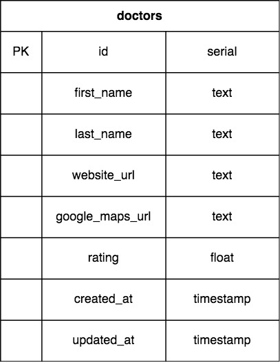

# Find a Doc

Find A Doc is an open-source project aimed at creating a database of doctors that speak multiple languages in Japan. Foreign residents living in Japan sometimes find it difficult to communicate their medical needs in Japanese, or would feel more comfortable doing so in their native language. Find A Doc is an initiative to help connect residents with doctors that they can communicate more easily with.

## How to Contribute

Anyone can contribute to the project, even if they don't know how to code! Please check the list below to see what features we could use your help with.

### Submit Work Via Git

Please open a pull request so that we can merge your work to the main branch once it has been reviewed and approved.

*Please use **Vetur** for formatting prior to opening a pull request.*

## Planned Features

Here are some of the features we'd like to include in the first release of the community page:

### Current Release  

1. Healthcare Database  
    a. Search by specialty  
    b. Sort by distance  
    c. User ratings  
    d. Link to clinic/hospital website
2. Accessible for people with disabilities  
    a. Text to speech

### Future Release   

1. Include other services such as:  
    a. Lawyers  
    b. Banks  
    c. Salons  
    d. Tax accountants  
2. Add a way for users to bookmark their favorites
3. Add additional languages
4. Improve accessibility  
5. Google Maps Integration  

## Demo  

https://findadocjp.herokuapp.com

## Database Schema

The `ourjapanlife` database currently consists of one table that follows the schema below:  

